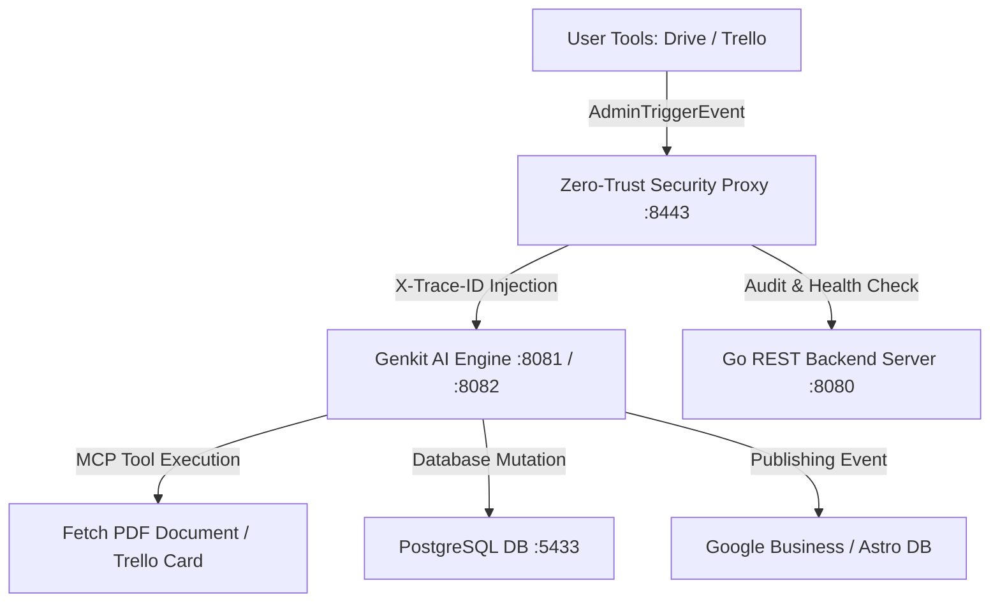

# 🍽️ Zero-UI Restaurant Administration Agent

An autonomous AI administration agent built for fine-dining restaurants. The system eliminates traditional web dashboards, allowing management to interact via familiar tools (Google Drive for menu PDFs, Trello for task boards, Google Business Profile for marketing) using **Model Context Protocol (MCP)** tools and **Firebase Genkit SDK (Go 1.25)**.

---

## 🏗️ Architecture Overview



### Key Subsystems

- **Genkit AI Engine (`my-genkit-gin/`)**: Written in Go 1.25 using Firebase Genkit SDK (`ZeroUIAdminFlow`).
- **Zero-Trust Security Proxy (`backend/middleware/`)**: Propagates `X-Trace-ID` headers and audits incoming agent requests.
- **REST Backend Server (`server/`)**: Go server hosting fine-dining PDF assets (`content/menu_guide.pdf`, `content/wine_pairing.pdf`) and health endpoints.
- **Kubernetes & Cloud Infrastructure (`k8s/`, `cloudbuild.yaml`)**: Complete manifests for Minikube local cluster and Google Cloud Build deployment.

---

## 🚀 Quickstart Guide

### 1. Docker Compose Cluster (Recommended)

Start all microservices in containers:
```bash
make up
```

Stop the cluster:
```bash
make down
```

### 2. Interactive Animated Initializer

Runs cross-platform OS detection (Linux, Windows 11, macOS) with animated terminal startup graphics:
```bash
python3 start.py
```
Or use platform-specific wrappers:
- **Linux / macOS**: `./start.sh`
- **Windows 11**: `.\start.ps1`

### 3. Local Kubernetes Cluster (Minikube)

Automated cluster setup and deployment to namespace `zero-trust-agent`:
```bash
./setup-minikube.sh
```

---

## ⚙️ Environment Variables

| Variable | Default Value | Description |
| :--- | :--- | :--- |
| `GEMINI_API_KEY` | *(Required)* | Gemini API credentials for Genkit model tool calling. |
| `PORT` | `8081` | Local port for Go Genkit AI Engine server. |
| `PROXY_PORT` | `8443` | Host port for Zero-Trust Proxy middleware. |
| `BACKEND_SERVER_URL` | `http://backend-server:8080` | Proxy target URL for backend REST API. |
| `DB_HOST` | `postgres-db` | Database hostname inside Docker/K8s networks. |

---

## 🌐 API & Endpoints Reference

| Service | Protocol | Port | Endpoint | Description |
| :--- | :--- | :--- | :--- | :--- |
| **Genkit AI Engine** | HTTP POST | `8082` | `/zeroUIAdminFlow` | Receives `AdminTriggerEvent` payloads. |
| **Zero-Trust Proxy** | HTTP GET/POST | `8443` | `/*` | Proxies requests with `X-Trace-ID` audit headers. |
| **Backend Go Server** | HTTP GET | `8080` | `/api/v1/health` | Service health status. |
| **Backend Go Server** | HTTP GET | `8080` | `/content/*` | Serves menu PDFs and fine-dining assets. |
| **Agent Frontend** | HTTP GET | `8000` | `/` | Web UI frontend dashboard. |

---

## 📦 Container Build & Cloud Deployment

### Google Cloud Build
Trigger automated multi-container builds via Google Cloud Build:
```bash
gcloud builds submit --config=cloudbuild.yaml .
```

---

## 🛠️ CLI Reference (`Makefile`)

| Target | Description |
| :--- | :--- |
| `make up` | Starts the Docker Compose microservice cluster (`-d`) |
| `make down` | Gracefully stops and cleans up cluster containers |
| `make logs` | Streams live logs for the Genkit AI engine container |
| `make run-local` | Runs the Go Genkit agent locally on port 8081 |

---

## 🔒 Zero-Trust Security & Traceability

Every request flowing into the proxy generates or preserves an `X-Trace-ID` header:
- **Header**: `X-Trace-ID: <32-hex-characters>`
- **Audit**: Logged across all microservice log streams for full trajectory auditability.
